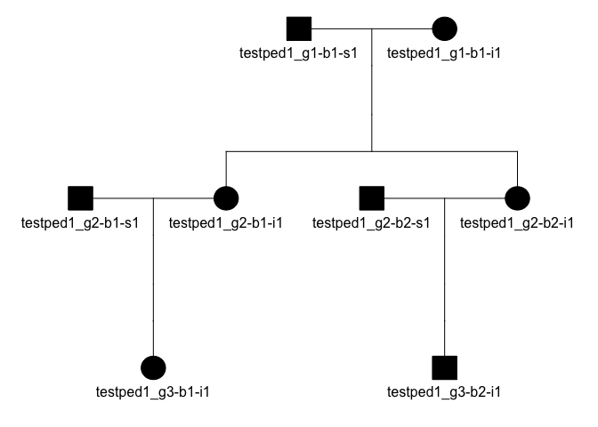

<!-- README.md is generated from README.Rmd. Please edit that file -->

# skater

<!-- badges: start -->

[](https://github.com/signaturescience/skater/actions)
<!-- badges: end -->

**S**NP-based **K**inship **A**nalysis **T**esting and **E**valuation:
miscellaneous **R** utilties.

## Installation

Install from GitHub:

``` r
remotes::install_github("signaturescience/skater", auth_token = github_pat(quiet))
```

A GitHub [personal access token](https://github.com/settings/tokens)
must be in the environment variable `GITHUB_PAT`.

## Examples

``` r
library(skater)
```

### Pedigrees and PLINK .fam files

Read a PLINK-formatted .fam file:

``` r
famfile <- system.file("extdata", "3gens.fam", package="skater", mustWork=TRUE)
fam <- read_fam(famfile)
fam
#> # A tibble: 64 x 6
#>    fid      id                dadid             momid               sex affected
#>    <chr>    <chr>             <chr>             <chr>             <int>    <int>
#>  1 testped1 testped1_g1-b1-s1 0                 0                     1        1
#>  2 testped1 testped1_g1-b1-i1 0                 0                     2        1
#>  3 testped1 testped1_g2-b1-s1 0                 0                     1        1
#>  4 testped1 testped1_g2-b1-i1 testped1_g1-b1-s1 testped1_g1-b1-i1     2        1
#>  5 testped1 testped1_g2-b2-s1 0                 0                     1        1
#>  6 testped1 testped1_g2-b2-i1 testped1_g1-b1-s1 testped1_g1-b1-i1     2        1
#>  7 testped1 testped1_g3-b1-i1 testped1_g2-b1-s1 testped1_g2-b1-i1     2        1
#>  8 testped1 testped1_g3-b2-i1 testped1_g2-b2-s1 testped1_g2-b2-i1     1        1
#>  9 testped2 testped2_g1-b1-s1 0                 0                     2        1
#> 10 testped2 testped2_g1-b1-i1 0                 0                     1        1
#> # … with 54 more rows
```

Convert each family into a pedigree object (see the [kinship2
vignette](https://cran.r-project.org/web/packages/kinship2/vignettes/pedigree.html)):

``` r
peds <- fam2ped(fam)
peds
#> # A tibble: 8 x 3
#>   fid      data             ped       
#>   <chr>    <list>           <list>    
#> 1 testped1 <tibble [8 × 5]> <pedigree>
#> 2 testped2 <tibble [8 × 5]> <pedigree>
#> 3 testped3 <tibble [8 × 5]> <pedigree>
#> 4 testped4 <tibble [8 × 5]> <pedigree>
#> 5 testped5 <tibble [8 × 5]> <pedigree>
#> 6 testped6 <tibble [8 × 5]> <pedigree>
#> 7 testped7 <tibble [8 × 5]> <pedigree>
#> 8 testped8 <tibble [8 × 5]> <pedigree>
```

In the example above, the resulting tibble is nested by family ID. The
`data` column contains the individual family information, while the
`ped` column contains the pedigree object for that family. You can
unnest any particular family:

``` r
peds %>% 
  dplyr::filter(fid=="testped1") %>% 
  tidyr::unnest(cols=data)
#> # A tibble: 8 x 7
#>   fid      id              dadid          momid            sex affected ped     
#>   <chr>    <chr>           <chr>          <chr>          <int>    <dbl> <list>  
#> 1 testped1 testped1_g1-b1… <NA>           <NA>               1        1 <pedigr…
#> 2 testped1 testped1_g1-b1… <NA>           <NA>               2        1 <pedigr…
#> 3 testped1 testped1_g2-b1… <NA>           <NA>               1        1 <pedigr…
#> 4 testped1 testped1_g2-b1… testped1_g1-b… testped1_g1-b…     2        1 <pedigr…
#> 5 testped1 testped1_g2-b2… <NA>           <NA>               1        1 <pedigr…
#> 6 testped1 testped1_g2-b2… testped1_g1-b… testped1_g1-b…     2        1 <pedigr…
#> 7 testped1 testped1_g3-b1… testped1_g2-b… testped1_g2-b…     2        1 <pedigr…
#> 8 testped1 testped1_g3-b2… testped1_g2-b… testped1_g2-b…     1        1 <pedigr…
```

You can also look at a single pedigree:

``` r
peds$ped[[1]]
#> Pedigree object with 8 subjects
#> Bit size= 4
```

Or plot that pedigree:

``` r
plot(peds$ped[[1]], mar=c(1,4,1,4))
```



The `plot_pedigree` function in the skater package will walk over a list
of pedigree objects, writing a multi-page PDF to file, with each page
containing a pedigree from each of the families:

``` r
plot_pedigree(peds$ped, file="3gens.ped.pdf")
```

The `ped2kinpair()` function takes a pedigree object and produces a
pairwise list of relationships with their expected kinship coefficient.

Run on a single family:

``` r
ped2kinpair(peds$ped[[1]])
#> # A tibble: 36 x 3
#>    id1               id2                   k
#>    <chr>             <chr>             <dbl>
#>  1 testped1_g1-b1-s1 testped1_g1-b1-s1 0.5  
#>  2 testped1_g1-b1-i1 testped1_g1-b1-s1 0    
#>  3 testped1_g1-b1-s1 testped1_g2-b1-s1 0    
#>  4 testped1_g1-b1-s1 testped1_g2-b1-i1 0.25 
#>  5 testped1_g1-b1-s1 testped1_g2-b2-s1 0    
#>  6 testped1_g1-b1-s1 testped1_g2-b2-i1 0.25 
#>  7 testped1_g1-b1-s1 testped1_g3-b1-i1 0.125
#>  8 testped1_g1-b1-s1 testped1_g3-b2-i1 0.125
#>  9 testped1_g1-b1-i1 testped1_g1-b1-i1 0.5  
#> 10 testped1_g1-b1-i1 testped1_g2-b1-s1 0    
#> # … with 26 more rows
```

Map over all families:

``` r
kinpairs <- 
  peds %>% 
  dplyr::mutate(pairs=purrr::map(ped, ped2kinpair)) %>% 
  dplyr::select(fid, pairs) %>% 
  tidyr::unnest(cols=pairs)
kinpairs
#> # A tibble: 288 x 4
#>    fid      id1               id2                   k
#>    <chr>    <chr>             <chr>             <dbl>
#>  1 testped1 testped1_g1-b1-s1 testped1_g1-b1-s1 0.5  
#>  2 testped1 testped1_g1-b1-i1 testped1_g1-b1-s1 0    
#>  3 testped1 testped1_g1-b1-s1 testped1_g2-b1-s1 0    
#>  4 testped1 testped1_g1-b1-s1 testped1_g2-b1-i1 0.25 
#>  5 testped1 testped1_g1-b1-s1 testped1_g2-b2-s1 0    
#>  6 testped1 testped1_g1-b1-s1 testped1_g2-b2-i1 0.25 
#>  7 testped1 testped1_g1-b1-s1 testped1_g3-b1-i1 0.125
#>  8 testped1 testped1_g1-b1-s1 testped1_g3-b2-i1 0.125
#>  9 testped1 testped1_g1-b1-i1 testped1_g1-b1-i1 0.5  
#> 10 testped1 testped1_g1-b1-i1 testped1_g2-b1-s1 0    
#> # … with 278 more rows
```

Note that this maps `ped2kinpair` over all `ped` objects in the input
tibble, and that relationships are not shown for between-family
relationships (which should all be zero).

### Degree inference

The `dibble()` function creates a **d**egree **i**nference tibble, with
degrees up to the specified `max_degree` (default=3), expected kinship
coefficient, and lower (`l`) and upper (`u`) inference ranges (see
[Manichaikul
2010](https://www.ncbi.nlm.nih.gov/pmc/articles/PMC3025716/)). Degree 0
corresponds to self / identity / MZ twins, with an expected kinship
coefficient of 0.5, with inference range &gt;=0.354. Anything beyond the
maximum degree resolution is considered unrelated (degree `NA`), with
expected kinship coefficient of 0.

``` r
dibble()
#> # A tibble: 5 x 4
#>   degree      k       l      u
#>    <int>  <dbl>   <dbl>  <dbl>
#> 1      0 0.5     0.354  1     
#> 2      1 0.25    0.177  0.354 
#> 3      2 0.125   0.0884 0.177 
#> 4      3 0.0625  0.0442 0.0884
#> 5     NA 0      -1      0.0442
```

The degree inference `max_degree` default is 3. Change this argument to
allow more granular degree inference ranges:

``` r
dibble(max_degree = 5)
#> # A tibble: 7 x 4
#>   degree      k       l      u
#>    <int>  <dbl>   <dbl>  <dbl>
#> 1      0 0.5     0.354  1     
#> 2      1 0.25    0.177  0.354 
#> 3      2 0.125   0.0884 0.177 
#> 4      3 0.0625  0.0442 0.0884
#> 5      4 0.0312  0.0221 0.0442
#> 6      5 0.0156  0.0110 0.0221
#> 7     NA 0      -1      0.0110
```

Note that the distance between relationship degrees becomes smaller as
the relationship degree becomes more distant. The `dibble()` function
will throw a warning with `max_degree` &gt;=10, and will stop with an
error at &gt;=12.

The `kin2degree()` function infers the relationship degree given a
kinship coefficient and a `max_degree` up to which anything more distant
is treated as unrelated. Example first degree relative:

``` r
kin2degree(.25, max_degree=3)
#> [1] 1
```

Example 4th degree relative, but using the default max\_degree
resolution of 3:

``` r
kin2degree(.0312, max_degree=3)
#> [1] NA
```

Example 4th degree relative, but increasing the degree resolution:

``` r
kin2degree(.0312, max_degree=5)
#> [1] 4
```

The `kin2degree()` function is vectorized over values of `k`, so can be
used inside of a `mutate` on a tibble of kinship coefficients:

``` r
# Get two pairs from each type of relationship we have in kinpairs:
kinpairs_subset <- 
  kinpairs %>% 
  dplyr::group_by(k) %>% 
  dplyr::slice(1:2)
kinpairs_subset
#> # A tibble: 10 x 4
#> # Groups:   k [5]
#>    fid      id1               id2                    k
#>    <chr>    <chr>             <chr>              <dbl>
#>  1 testped1 testped1_g1-b1-i1 testped1_g1-b1-s1 0     
#>  2 testped1 testped1_g1-b1-s1 testped1_g2-b1-s1 0     
#>  3 testped1 testped1_g3-b1-i1 testped1_g3-b2-i1 0.0625
#>  4 testped2 testped2_g3-b1-i1 testped2_g3-b2-i1 0.0625
#>  5 testped1 testped1_g1-b1-s1 testped1_g3-b1-i1 0.125 
#>  6 testped1 testped1_g1-b1-s1 testped1_g3-b2-i1 0.125 
#>  7 testped1 testped1_g1-b1-s1 testped1_g2-b1-i1 0.25  
#>  8 testped1 testped1_g1-b1-s1 testped1_g2-b2-i1 0.25  
#>  9 testped1 testped1_g1-b1-s1 testped1_g1-b1-s1 0.5   
#> 10 testped1 testped1_g1-b1-i1 testped1_g1-b1-i1 0.5

# Infer degree out to third degree relatives:
kinpairs_subset %>% 
  dplyr::mutate(degree=kin2degree(k, max_degree=3))
#> # A tibble: 10 x 5
#> # Groups:   k [5]
#>    fid      id1               id2                    k degree
#>    <chr>    <chr>             <chr>              <dbl>  <int>
#>  1 testped1 testped1_g1-b1-i1 testped1_g1-b1-s1 0          NA
#>  2 testped1 testped1_g1-b1-s1 testped1_g2-b1-s1 0          NA
#>  3 testped1 testped1_g3-b1-i1 testped1_g3-b2-i1 0.0625      3
#>  4 testped2 testped2_g3-b1-i1 testped2_g3-b2-i1 0.0625      3
#>  5 testped1 testped1_g1-b1-s1 testped1_g3-b1-i1 0.125       2
#>  6 testped1 testped1_g1-b1-s1 testped1_g3-b2-i1 0.125       2
#>  7 testped1 testped1_g1-b1-s1 testped1_g2-b1-i1 0.25        1
#>  8 testped1 testped1_g1-b1-s1 testped1_g2-b2-i1 0.25        1
#>  9 testped1 testped1_g1-b1-s1 testped1_g1-b1-s1 0.5         0
#> 10 testped1 testped1_g1-b1-i1 testped1_g1-b1-i1 0.5         0
```

### Confusion matrix

The skater package adapts functionality from the
[m-clark/confusion\_matrix](https://github.com/m-clark/confusionMatrix)
package to create a confusion matrix and statistics with minimal
dependencies.

First, take the `kinpairs` data from above and randomly flip \~20% of
the true relationship degrees.

``` r
# Function to randomly flip levels of a factor (at 20%, by default)
randomflip <- function(x, p=.2) ifelse(runif(length(x))<p, sample(unique(x)), x)

# Infer degree (truth/target) using kin2degree, then randomly flip 20% of them
set.seed(42)
kinpairs_inferred <- kinpairs %>% 
  dplyr::mutate(degree_truth=kin2degree(k, max_degree=3)) %>% 
  dplyr::mutate(degree_truth=tidyr::replace_na(degree_truth, "unrelated")) %>% 
  dplyr::mutate(degree_inferred=randomflip(degree_truth))
kinpairs_inferred
#> # A tibble: 288 x 6
#>    fid      id1              id2                  k degree_truth degree_inferred
#>    <chr>    <chr>            <chr>            <dbl> <chr>        <chr>          
#>  1 testped1 testped1_g1-b1-… testped1_g1-b1-… 0.5   0            0              
#>  2 testped1 testped1_g1-b1-… testped1_g1-b1-… 0     unrelated    unrelated      
#>  3 testped1 testped1_g1-b1-… testped1_g2-b1-… 0     unrelated    unrelated      
#>  4 testped1 testped1_g1-b1-… testped1_g2-b1-… 0.25  1            1              
#>  5 testped1 testped1_g1-b1-… testped1_g2-b2-… 0     unrelated    unrelated      
#>  6 testped1 testped1_g1-b1-… testped1_g2-b2-… 0.25  1            1              
#>  7 testped1 testped1_g1-b1-… testped1_g3-b1-… 0.125 2            2              
#>  8 testped1 testped1_g1-b1-… testped1_g3-b2-… 0.125 2            1              
#>  9 testped1 testped1_g1-b1-… testped1_g1-b1-… 0.5   0            0              
#> 10 testped1 testped1_g1-b1-… testped1_g2-b1-… 0     unrelated    unrelated      
#> # … with 278 more rows
```

The `confusion_matrix` function on its own outputs a list with three
objects:

1.  Calculates accuracy, lower and upper bounds, the guessing rate and
    p-value of the accuracy vs. the guessing rate.
2.  Calculates by class the following statistics:

-   Sensitivity = A/(A+C)
-   Specificity = D/(B+D)
-   Prevalence = (A+C)/(A+B+C+D)
-   Positive Predictive Value = (sensitivity \*
    prevalence)/((sensitivity*prevalence) +
    ((1-specificity)*(1-prevalence)))
-   Negative Predictive Value = (specificity \*
    (1-prevalence))/(((1-sensitivity)*prevalence) +
    ((specificity)*(1-prevalence)))
-   Detection Rate = A/(A+B+C+D)
-   Detection Prevalence = (A+B)/(A+B+C+D)
-   Balanced Accuracy = (sensitivity+specificity)/2
-   Precision = A/(A+B)
-   Recall = A/(A+C)
-   F1 = harmonic mean of precision and recall
-   False Discovery Rate = 1 - Positive Predictive Value
-   False Omission Rate = 1 - Negative Predictive Value
-   False Positive Rate = 1 - Specificity
-   False Negative Rate = 1 - Sensitivity

1.  The contingency table object itself.

``` r
confusion_matrix(prediction = kinpairs_inferred$degree_inferred, 
                 target = kinpairs_inferred$degree_truth)
#> $Accuracy
#> # A tibble: 1 x 5
#>   Accuracy `Accuracy LL` `Accuracy UL` `Accuracy Guessing` `Accuracy P-value`
#>      <dbl>         <dbl>         <dbl>               <dbl>              <dbl>
#> 1    0.812         0.763         0.856               0.333           1.09e-62
#> 
#> $Other
#> # A tibble: 6 x 15
#>   Class     N `Sensitivity/Re… `Specificity/TN… `PPV/Precision`   NPV `F1/Dice`
#>   <chr> <dbl>            <dbl>            <dbl>           <dbl> <dbl>     <dbl>
#> 1 0      64              0.75             0.964           0.857 0.931     0.8  
#> 2 1      72              0.806            0.944           0.829 0.936     0.817
#> 3 2      48              0.833            0.967           0.833 0.967     0.833
#> 4 3       8              0.75             0.936           0.25  0.992     0.375
#> 5 unre…  96              0.854            0.958           0.911 0.929     0.882
#> 6 Aver…  57.6            0.799            0.954           0.736 0.951     0.741
#> # … with 8 more variables: Prevalence <dbl>, `Detection Rate` <dbl>, `Detection
#> #   Prevalence` <dbl>, `Balanced Accuracy` <dbl>, FDR <dbl>, FOR <dbl>,
#> #   `FPR/Fallout` <dbl>, FNR <dbl>
#> 
#> $Table
#>            Target
#> Predicted    0  1  2  3 unrelated
#>   0         48  4  2  1         1
#>   1          5 58  4  0         3
#>   2          0  3 40  1         4
#>   3          8  4  0  6         6
#>   unrelated  3  3  2  0        82
```

Pluck out just the contingency table:

``` r
confusion_matrix(prediction = kinpairs_inferred$degree_inferred, 
                 target = kinpairs_inferred$degree_truth) %>% 
  purrr::pluck("Table")
#>            Target
#> Predicted    0  1  2  3 unrelated
#>   0         48  4  2  1         1
#>   1          5 58  4  0         3
#>   2          0  3 40  1         4
#>   3          8  4  0  6         6
#>   unrelated  3  3  2  0        82
```

Output in tidy (`longer=TRUE`) format, then spread stats by class:

``` r
confusion_matrix(prediction = kinpairs_inferred$degree_inferred, 
                 target = kinpairs_inferred$degree_truth, 
                 longer = TRUE) %>% 
  purrr::pluck("Other") %>% 
  tidyr::spread(Class, Value) %>% 
  dplyr::relocate(Average, .after=dplyr::last_col()) %>% 
  dplyr::mutate_if(rlang::is_double, signif, 2) %>% 
  knitr::kable()
```

| Statistic              |      0 |      1 |      2 |      3 | unrelated | Average |
|:-----------------------|-------:|-------:|-------:|-------:|----------:|--------:|
| Balanced Accuracy      |  0.860 |  0.880 |  0.900 | 0.8400 |     0.910 |   0.880 |
| Detection Prevalence   |  0.190 |  0.240 |  0.170 | 0.0830 |     0.310 |   0.200 |
| Detection Rate         |  0.170 |  0.200 |  0.140 | 0.0210 |     0.280 |   0.160 |
| F1/Dice                |  0.800 |  0.820 |  0.830 | 0.3800 |     0.880 |   0.740 |
| FDR                    |  0.140 |  0.170 |  0.170 | 0.7500 |     0.089 |   0.260 |
| FNR                    |  0.250 |  0.190 |  0.170 | 0.2500 |     0.150 |   0.200 |
| FOR                    |  0.069 |  0.064 |  0.033 | 0.0076 |     0.071 |   0.049 |
| FPR/Fallout            |  0.036 |  0.056 |  0.033 | 0.0640 |     0.042 |   0.046 |
| N                      | 64.000 | 72.000 | 48.000 | 8.0000 |    96.000 |  58.000 |
| NPV                    |  0.930 |  0.940 |  0.970 | 0.9900 |     0.930 |   0.950 |
| PPV/Precision          |  0.860 |  0.830 |  0.830 | 0.2500 |     0.910 |   0.740 |
| Prevalence             |  0.220 |  0.250 |  0.170 | 0.0280 |     0.330 |   0.200 |
| Sensitivity/Recall/TPR |  0.750 |  0.810 |  0.830 | 0.7500 |     0.850 |   0.800 |
| Specificity/TNR        |  0.960 |  0.940 |  0.970 | 0.9400 |     0.960 |   0.950 |

## Package data

### Package data objects

Unexported objects `ped1kg` and `ped1kg_unrel` contain [pedigree data
obtained from 1000 Genomes
FTP](http://ftp.1000genomes.ebi.ac.uk/vol1/ftp/release/20130502/integrated_call_samples_v3.20200731.ALL.ped)
for all 2504 individuals with sequencing data, and all individuals
unrelated to anyone else in the data (momid, dadid, siblings,
second\_order, and third\_order all =0). This code gets all the unique
IDs for anyone listed as a mother, father, sibling, child, second order,
or third order relative, *who also has sequencing data*, and removes any
*individual ID* who matches one of these relatives. See
[data-raw/generate\_sysdata.R](data-raw/generate_sysdata.R),
specifically the code that begins with the `relatives <-` assignment.

``` r
skater:::ped1kg
#> # A tibble: 2,504 x 13
#>    fid   id    dadid momid   sex affected population relationship siblings
#>    <chr> <chr> <chr> <chr> <dbl>    <dbl> <chr>      <chr>        <chr>   
#>  1 HG00… HG00… 0     0         1        0 GBR        unrel        0       
#>  2 HG00… HG00… 0     0         2        0 GBR        unrel        0       
#>  3 HG00… HG00… 0     0         2        0 GBR        unrel        0       
#>  4 HG00… HG00… 0     0         2        0 GBR        unrel        0       
#>  5 HG00… HG00… 0     0         1        0 GBR        unrel        0       
#>  6 HG00… HG00… 0     0         2        0 GBR        unrel        0       
#>  7 HG00… HG00… 0     0         1        0 GBR        unrel        0       
#>  8 HG00… HG00… 0     0         1        0 GBR        unrel        0       
#>  9 HG00… HG00… 0     0         2        0 GBR        unrel        0       
#> 10 HG00… HG00… 0     0         1        0 GBR        unrel        0       
#> # … with 2,494 more rows, and 4 more variables: second_order <chr>,
#> #   third_order <chr>, children <chr>, other_comments <chr>
skater:::ped1kg_unrel
#> # A tibble: 2,502 x 13
#>    fid   id    dadid momid   sex affected population relationship siblings
#>    <chr> <chr> <chr> <chr> <dbl>    <dbl> <chr>      <chr>        <chr>   
#>  1 HG00… HG00… 0     0         1        0 GBR        unrel        0       
#>  2 HG00… HG00… 0     0         2        0 GBR        unrel        0       
#>  3 HG00… HG00… 0     0         2        0 GBR        unrel        0       
#>  4 HG00… HG00… 0     0         2        0 GBR        unrel        0       
#>  5 HG00… HG00… 0     0         1        0 GBR        unrel        0       
#>  6 HG00… HG00… 0     0         2        0 GBR        unrel        0       
#>  7 HG00… HG00… 0     0         1        0 GBR        unrel        0       
#>  8 HG00… HG00… 0     0         1        0 GBR        unrel        0       
#>  9 HG00… HG00… 0     0         2        0 GBR        unrel        0       
#> 10 HG00… HG00… 0     0         1        0 GBR        unrel        0       
#> # … with 2,492 more rows, and 4 more variables: second_order <chr>,
#> #   third_order <chr>, children <chr>, other_comments <chr>
```

There are **2** samples who have known relatives in the 1000 Genomes ped
file (included in `ped1kg` but not in `ped1kg_unrel`):

``` r
skater:::ped1kg %>% 
  dplyr::anti_join(skater:::ped1kg_unrel) %>% 
  dplyr::select(fid, id, population, second_order:other_comments) %>% 
  knitr::kable()
#> Joining, by = c("fid", "id", "dadid", "momid", "sex", "affected", "population", "relationship", "siblings", "second_order", "third_order", "children", "other_comments")
```

| fid     | id      | population | second\_order | third\_order | children | other\_comments                          |
|:--------|:--------|:-----------|:--------------|:-------------|:---------|:-----------------------------------------|
| LWK001  | NA19331 | LWK        | 0             | NA19334      | NA19313  | Parent/Child directionality is uncertain |
| NA19334 | NA19334 | LWK        | NA19313       | NA19331      | 0        | 0                                        |

### Text files with unrelated founder sample IDs

After creating the `ped1kg_unrel` object in
[data-raw/generate\_sysdata.R](data-raw/generate_sysdata.R) as described
above, the code in
[data-raw/write-sampleids-1000g-unrelated.R](data-raw/write-sampleids-1000g-unrelated.R)
then writes one sample ID per line for each of those unrelated samples
to `inst/extdata`. These can be used to pass to
`bcftools view --samples-file <POP.txt>`.

The directory containing these files can be found on any system where
skater is installed. On MacOS, this is usually something like
`/Library/Frameworks/R.framework/Versions/4.0/Resources/library/skater/extdata/sampleids-1000g-unrelated`.

``` r
system.file("extdata", "sampleids-1000g-unrelated", package="skater", mustWork=TRUE)
```

The table below shows how many unrelated founders are available in any
given population:

``` r
system.file("extdata", "sampleids-1000g-unrelated", package="skater", mustWork=TRUE) %>% 
  list.files(full.names=TRUE) %>% 
  rlang::set_names(basename) %>% 
  purrr::map_int(~length(readr::read_lines(.))) %>% 
  tibble::enframe() %>% 
  knitr::kable()
```

| name    | value |
|:--------|------:|
| ACB.txt |    96 |
| ASW.txt |    61 |
| BEB.txt |    86 |
| CDX.txt |    93 |
| CEU.txt |    99 |
| CHB.txt |   103 |
| CHS.txt |   105 |
| CLM.txt |    94 |
| ESN.txt |    99 |
| FIN.txt |    99 |
| GBR.txt |    91 |
| GIH.txt |   103 |
| GWD.txt |   113 |
| IBS.txt |   107 |
| ITU.txt |   102 |
| JPT.txt |   104 |
| KHV.txt |    99 |
| LWK.txt |    97 |
| MSL.txt |    85 |
| MXL.txt |    64 |
| PEL.txt |    85 |
| PJL.txt |    96 |
| PUR.txt |   104 |
| STU.txt |   102 |
| TSI.txt |   107 |
| YRI.txt |   108 |
